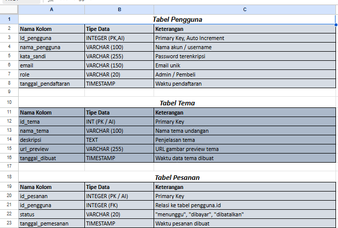
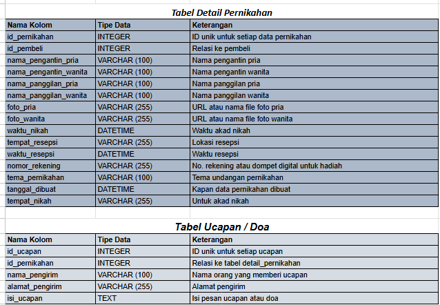

# Wedding Invitation Website 💍🎉

Website undangan pernikahan berbasis web yang dibuat menggunakan **HTML, CSS, JavaScript, dan PHP** dengan database **MySQL**.  
Digunakan untuk menampilkan undangan digital dan menyimpan data tamu serta RSVP.

---

## Struktur Database

  

> Pastikan file `r1.PNG` dan `r2.PNG` berada di folder yang sama dengan `README.md`.

---

## 🚀 Fitur
- Landing page undangan
- Data mempelai
- Informasi acara
- Galeri foto
- RSVP / Buku tamu
- Simpan data ke database
- Responsive design

---

## 🛠️ Teknologi
- HTML
- CSS
- JavaScript
- PHP
- MySQL
- Laragon
